# SQL Server DBA Tool 소개

SQL Server DBA Tool 은 MSSQL 설치형 서버 2대를 이용해 자동 장애 복구가 가능한 시스템을 구성할 수 있습니다. 기존 CDB MSSQL RDS는 관리자 권한이 없어, 여러 제약이 있었으나 (암호화, SQL Server CLR, 인하우스 프로그램 운영 등), 설치형 MSSQL 서버를 이용해 구성하면, 이러한 제약이 없어집니다. 

SQL Server DBA Tool 은 설치형 서버에 사용자가 직접 명령을 내리는것과 완전히 동일하며, 누구나 이러한 도구를 만들고 자동화 할 수 있습니다. 본 프로그램은 NCP 자동화 제어 예시 프로그램이며, NCP 콘솔, 윈도우, SQL Server 자동화 운영 방법을 보여줍니다. GPL V3 라이선스 아래 누구나 프로그램을 수정 및 배포 할 수 있습니다. 

## 주요기능

1. 로드 밸런스를 이용한 자동 장애 복구 
   - 서버 생성 및 로드밸런서 매핑 (NCP API 이용해 NCP 콘솔을 WinForm으로 구현함)
   - 원클릭 데이터베이스 미러링
2. 데이터베이스 자동 백업 및 기간 초과 백업 자동 삭제 (로컬 1차 백업, 오브젝트 스토리지 2차 백업)
3. 데이터베이스 설정 템플릿 
   - sp_configure 
   - TraceFlag 
   - Sql Service Port
   - Collation 
4. OS 성능 베이스라인 수집 (Perfmon)
5. SQL Server 성능 베이스라인 수집 (SqlMon)
   - dm_exec_query_stats (실행 완료된 쿼리의 성능 데이터 정보)
   - dm_os_workers (실행 중인 쿼리의 성능 데이터 정보)
   - sp_lock (잠금 쿼리 확인)
6. Query 실행기
   - 미러링 그룹 내 Master Slave에 Template 쿼리 실행
   - 사용자가 임의 구성한 그룹에 동일한 쿼리 실행 (Multi Thread)
7. PowerShell 실행기 
   - 모든 PowerShell 명령 수행 가능
8. Rest 명령어 수행
   1. SQL Server DBA Tool  을 이용해 서버를 생성하면 자동으로 Agent 가 설치되고,  hMac 인증을 이용해 Agent 와 통신해 명령을 수행함


## 동작 개요

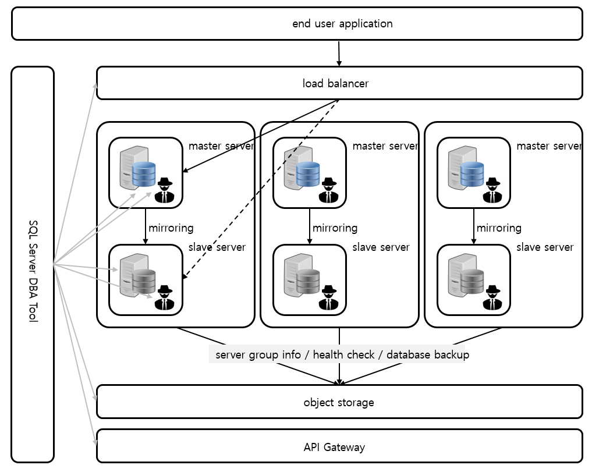

​										                             [그림1] SQL Server DBA Tool 구조도


- SQL Server DBA Tool 을 이용해 서버를 생성하면, Init Script 를 이용해 Agent 가 설치됩니다. 이 후, SQL Server 는 설정한 템플릿 형태로 설정 가능하며, 손쉽게 데이터베이스 미러링으로 이중화 할 수 있습니다. 이중화 된 서버는 로드 밸런스를 이용해 단일 이름으로 주 서버에 접근할 수 있습니다. (장애 조치 시간은 통상적으로 1분이 소요됩니다.) SQL Server DBA Tool의 모든 관리 정보는 오브젝트 스토리지에 저장되고, 툴을 새로운 서버에 설치하더라도 오브젝트 스토리지의 버킷 정보만 동일하면 동일한 서버 리스트를 관리할 수 있습니다. 
- 서버 장애 조치 기준, 백업 및 삭제 주기를 사용자가 설정할 수 있으며, 성능 베이스라인 정보를 로컬 lazylog 데이터베이스에 저장할 수 있습니다.
- Tool 메뉴에 있는 Executer Sql, Executer Multi Server Sql 을 이용해 쿼리를 동시에 수행할 수 있고, Executer Agent를 이용해 관리자 권한으로 PowerShell 명령을 수행할 수 있습니다. 또한 NCP 에서 제공하는 API 는 Executer Ncp Api 메뉴를 통해 실행 해 볼 수 있습니다. 각 템플릿은 사용자가 추가 수정 삭제 가능합니다. 
- SQL Server DBA Tool과  각 서버에 Init Script 로 설치한 Agent 간 통신은 인증서 기반 https 암호화 통신을 하며, 설정 파일은 암호화 되어 있습니다(초기에 설정된 암호를 그대로 사용하지 마세요).  Agent 가 설치된 폴더는 일반 사용자가 접근 할 수 없습니다.


## 동작

### 서버 생성 및 로드밸런서를 이용한 고가용 서버 그룹 설정 

1. NCP 
   1. NCP에 가입 후, 마이페이지 > 인증키 관리에서 키를 생성합니다. (SQL Server 에 접근하는 관리자 암호를 보호하기 위해 Local Key 대신 KMS를 사용할 경우 Sub Account 인증키가 필요합니다. )
      - [KMS 설정 도움말](./readme_kms.md)
   2. Console에서 ACG를 만든 후 이름을 확인 합니다. (Console > Server > ACG)
      - sql server : 14333 (변경가능), 5022 (변경 불가능)
        포트를 변경 할 경우, 변경한 포트를 ACG에 포함해 주세요.
      - agent : 9090
      - mstsc : 3389
2. SQL Server DBA Tool
   1. Config
      1. Encryption Key를 설정 합니다. 
         Local 의 경우 암호화 키가 각 서버의 로컬에 저장되며, NCP KMS 를 사용할 경우 키가 안전하게 보호됩니다. 자세한 내용은 [KMS 서비스](https://docs.ncloud.com/ko/kms/kms-1-1.html)를 참조하시길 바랍니다. 
      2. Object Storage에서 bucket을 만들고 확인합니다. 
         bucket 이름은 전체 테넌트에서 유일해야 합니다. (GroupName 이라는 이름을 사용 할 수 없습니다.)
         Object Storage 내 파일을 보려면 콘솔의 Object Storage 항목이나 [S3 Browser](https://s3browser.com/)를 사용합니다. 
      3. Login Key Setting에서 초기 Administrator 계정 암호 확인을 위한 인증키 이름을 선택하거나 생성합니다. 로컬에 pem 파일을 저장해 두면, SQL Server DBA Tool 에서 Administrator 암호를 바로 확인 가능합니다 (Server > Create IP and Server Management > Get Password). 서버 Administrator 의 암호는 SQL Server DBA Tool > Server > Set Sql Server 항목에서 설치가 성공적으로 완료되지 않을때만 필요하며, 성공적으로 설정 된 경우, MSTSC 접근시 SQL Id, Password 로 접근 가능합니다. (자동으로 OS 계정 추가됨)
      4. Init Script에서 스크립트와 Agent 파일을 Upload하고 Verify 합니다. 
         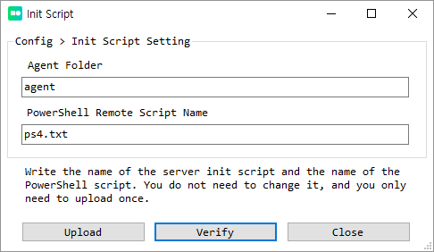
      5. Configuration Check 에서 SQL Server DBA 툴 설정을 체크 할 수 있습니다. **오류 발생시 다른 단계에서 오류가 발생 합니다.** (서버 생성전 체크해 아래와 같은 결과가 나오는지 확인 바랍니다.)
         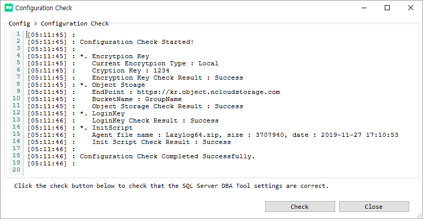
      
   2. Server
   
      1. Create Server 
         1. 서버 리전과 존을 선택하고 적당한 Server Spec 을 선택합니다. 
         3. 서버 이름 중복을 확인하고 서버를 생성합니다. 
         4. 서버가 생성 될 때까지 10분간 대기합니다. 
            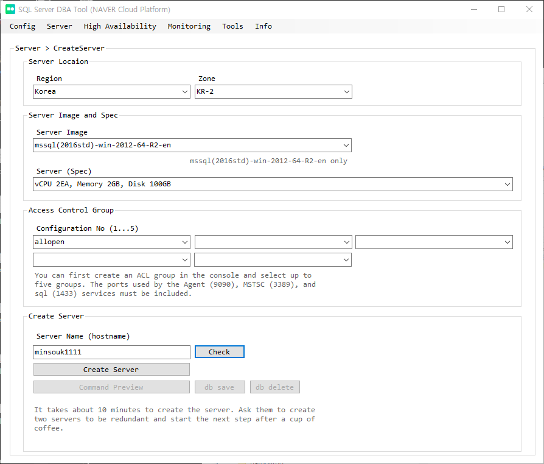
      2. Create IP and Server Management
         1. Server List에서 서버 선택 후, Public Ip Create Or Assocation 탭의 Create 버튼을 클릭합니다. 
         2. Public Ip Create Or Assocation 탭의 IpStatus 와 IpOperation 이 USED NULL 상태가 될 때까지 **Reload** 합니다. 
         3. 이 항목의 위 항목 Public IP는 Region 과 Zone 에 종속 되지만, 아래 Server List 는 모든 리전에서 SQL Server DBA Tool 로 생성한 모든 서버가 출력됩니다. 서버 리스트는 파일DB 로 Object Storage 에 저장 됩니다.
      3. Agent Key Setting
         1. Server List 에서 서버 선택 후, Agent Key Setting Type 에서 Set Agent Key 버튼을 클릭합니다. 
         2. 실패할 경우 재시도 합니다.
         3. 키 셋팅이 안되면, 아래 모든 작업이 실패 합니다. 
      4. Set Sql Server 
         1. 기본 템플릿에 저장된 **아이디와** **암호를 적절히 수정 후**, Save Template 를 클릭합니다. 기본 템플릿의 Id 와 Password 는 보안에 매우 취약하며, 암호는 적절한 복잡도를 만족해야 합니다. 
         2. Server List에서 서버 선택 후, Set Sql Server 버튼을 클릭합니다. 
         3. 진행 상황과 로그를 살펴보고 실패 할 경우 재시도 합니다. (1대 서버를 설정할 때 10분을 넘지 않습니다.)
            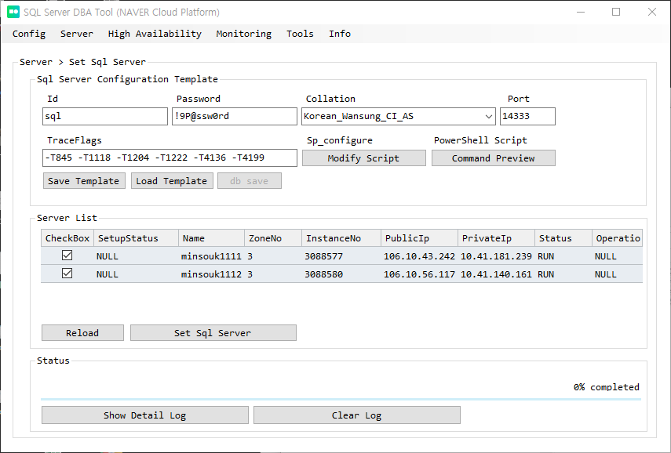
      5. Set Server Disk
         1. Server List에서 디스크를 생성할 서버 선택 후, Get BlockStorage Info 버튼을 클릭합니다. 
         2. Block Storage List에서 Storage Name과 Size 입력 후, Create 버튼을 누릅니다. 
            (10GB 단위로만 입력할 수 있습니다.)
         3. 추가한 Block Storage Status 와 Operation 상태가 ATTAC, NULL 상태가 될 때까지 **Reload** 합니다. 
         4. 상태 확인이 되면 Mount 버튼을 클릭합니다. 
         5. Mount 가 완료된 후 Server Get-Disk Info 버튼을 눌러 마운트 되었는지 확인합니다. 
   
   3. High Availability 
      1. Create Load Balancer and Set HA Group
         1. Load Balancer Configuration Template에서 이름을 적절히 변경하고 기타 정보를 확인 후, Load Balancer List에서 Create 버튼을 클릭 합니다. 
         2. Status 와 Operation 상태가 USED NULL 상태가 될 때까지 **Reload** 합니다. 
         3. Load Balancer List에서 설정한 Load Balancer 의 CheckBox에 체크한 후 Load HA Info 버튼을 클릭합니다. 
         4. 아래 HA Allocation Server에서 Master, Slave 서버를 선택 후 Set HA 버튼을 클릭합니다.
             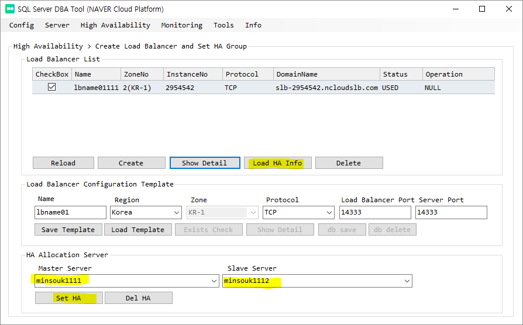
   
   4. Tool
      1. Executer Sql 페이지를 열고 Select HA Group의 Reload 버튼을 누릅니다. 
   
      2. Master 와 Slave에 데이터베이스를 생성할 폴더를 생성합니다. 
   
      3. Master 서버에 데이터베이스를 생성합니다. 
   
         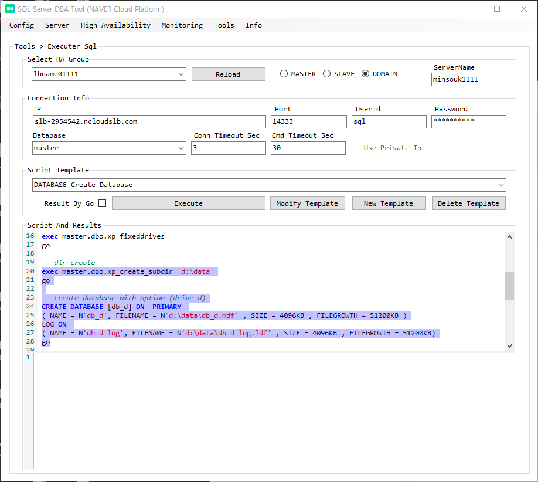
   
   5. High Availability 
      1.  Database Mirroring 
         1. Select HA Group에서 Reload 버튼을 클릭합니다. 
         2. 미러링을 위한 Initial backup path에서 Check 버튼을 클릭합니다. 폴더가 없으면 생성을 시도합니다. 정상적으로 path 가 확인되면 ok로 상태가 변경됩니다. 
         3. Master Server Database List에서 Recovery Model 이 FULL인 데이터베이를 CheckBox에서 선택한 후 Start Automatic Mirroring 버튼을 클릭 합니다. 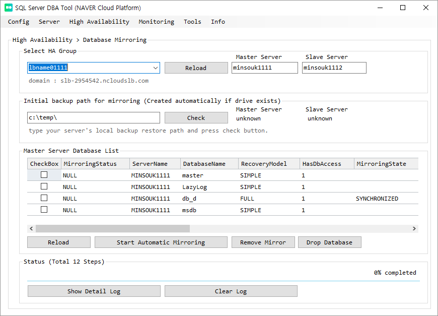
         4. **Select Ha Group 에서 현재 master 와 slave 서버의 정보가 올바른지 확인하고, 올바르지 않다면 Reload 후 작업 합니다.** 

### 장애 조치 설정과 백업 정책 설정

장애 조치에 대한 설정과, 백업, 백업 삭제 주기를 설정할 수 있습니다. 

#### 장애 조치 설정

- SQL Server DBA Tool > High Availability > Failover Policy 
  - Failover HeartBeat Check Interval : 권장 값은 5초 입니다. 
  - If there is no HeartBeat for the specified time, failover : 권장 값은 30초 입니다. 
  - Failover HeartBeat Check Interval 이 0 이면 장애 조치가 동작하지 않습니다. 
  - Select Server 그룹박스에서 Save Policy를 눌러 정보를 저장합니다. 
  - 유지관리를 위한 시스템 재부팅은 Slave 서버 부터 진행해야 합니다. 

#### 백업 및 삭제 주기 설정

- SQL Server DBA Tool > High Availability > Backup Policy
  - Full Backup Interval : 지정된 주기로 전체 백업을 수행 합니다. 권장 초는 86400 초 입니다. 
  - Transaction log Backup Interval : 지정된 주기로 로그 백업을 수행합니다. 권장 초는 3600 초 입니다. 
  - Backup Path : 백업 드라이브의 Path를 입력합니다. 해당 Path 는 자동으로 생성됩니다. 
  - Backup Compression : 백업 압축 옵션을 설정합니다. 권장 값은  Y 입니다. 
  - Delete Backup Local : 보관 기간이 초과한 백업 파일을 자동 삭제합니다. 권장 값은 86400 초 입니다. 
  - Delete Backup ObjectStorage : 보관 기간이 초과한 백업 파일을 자동 삭제합니다. 권장값은 86400 초 입니다. 

### 모니터링

#### OS 성능 모니터링

로컬에 설치된 Agent를 통해 lazylog 데이터베이스에 Perfmon 성능을 저장할 수 있습니다. 서버 선택 후 Load Policy를 눌러 주기를 확인하고, Save Policy 를 통해 정책을 저장할 수 있습니다. 

- SQL Server DBA Tool > Monitoring > Perfmon Policy
  - Perfmon Probe Interval : 성능 카운터 수집 주기를 설정합니다. 권장 값은 10초 입니다. 
  - Retention Period : 지정된 기간이 초과한 데이터를 삭제합니다. 
  - Using Cloud Insight : 아직 지원되지 않습니다. 향후 NCP Cloud Insight 상품과 연동 될 계획이며, 성능 그래프를 콘솔에서 모니터링하고, 임계치 초과 시 알람 설정이 가능하게 할 계획입니다. 

#### SQL 성능 모니터링

- SQL Server DBA Tool > Monitoring > Sqlmon Policy
  - dm_exec_query_stats : 실행 완료된 쿼리의 통계를 저장할 주기를 입력합니다. 권장 값은 60초 이며, delta 값을 계산해 입력됩니다.  
  - dm_os_workers : 실행중인 쿼리 상태를 저장합니다. 권장 값은 60초 입니다. 
  - sp_lock : 잠금 관련 정보를 저장합니다. 권장값은 3초 입니다. 
  - Retention Period : 데이터 삭제 임계값을 입력합니다. 권장 값은 1140 분 입니다. 

## 툴(부가 기능)

### Executer Sql 

고가용 그룹으로 묶여있는 서버에 손쉽게 접근할 수 있습니다. Script Template에는 유용한 스크립트 템플릿이 포함되어 있으며, 사용자가 템플릿을 추가 수정 삭제 가능합니다. 실행 **단축키는 F5** 입니다. 아래는 쿼리 실행 후 실행 계획, 실행 시간,  IO를 확인하는 예시입니다. 

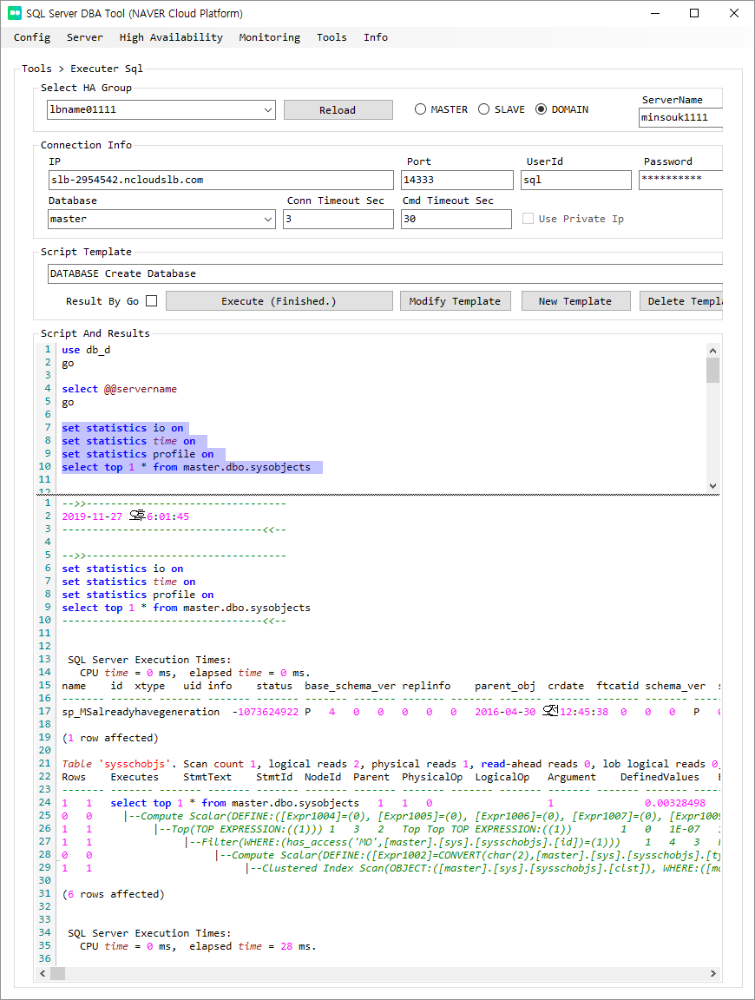

### Executer Multi Server Sql

사용자가 설정한 다중 서버에 동시(Multi Thread)에 쿼리를 실행할 수 있습니다. 샤딩을 구성해 서버를 구성하거나 동일 쿼리를 여러 서버에 실행해야 할 때 유용합니다. 아래 예제는 3개 서버에 명령을 동시에 실행하고, 2개 서버는 정상적으로 실행이 완료되고 1개 서버는 connection 실패로 error 가 발생한 경우입니다. 좌측 서버 리스트에서 Log 버튼을 클릭하면 해당 서버의 실행 로그를 확인할 수 있습니다. 실행 **단축키는 F5**입니다. 아래는 여러 서버에 백업 수행 후 결과를 확인하는 예시입니다. 

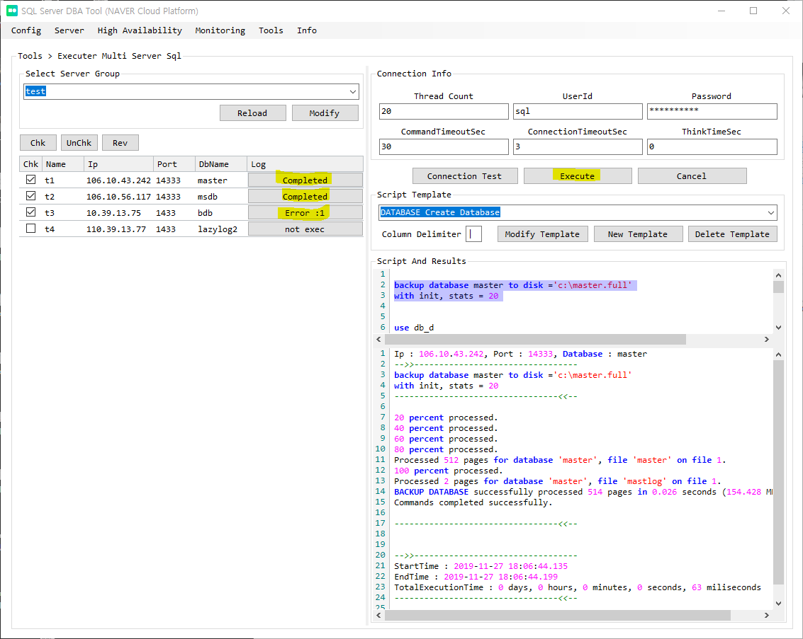

### Executer Agent 

Agent가 설치된 서버에 Agent를 통해 PowerShell명령을 수행할 수 있습니다. Script Template에는 유용한 스크립트 템플릿이 포함되어 있으며, 사용자가 템플릿을 추가 수정 삭제 가능합니다. 실행 **단축키는 F8**입니다. 아래는 DIR 명령 수행 후 결과를 확인하는 예시입니다. 

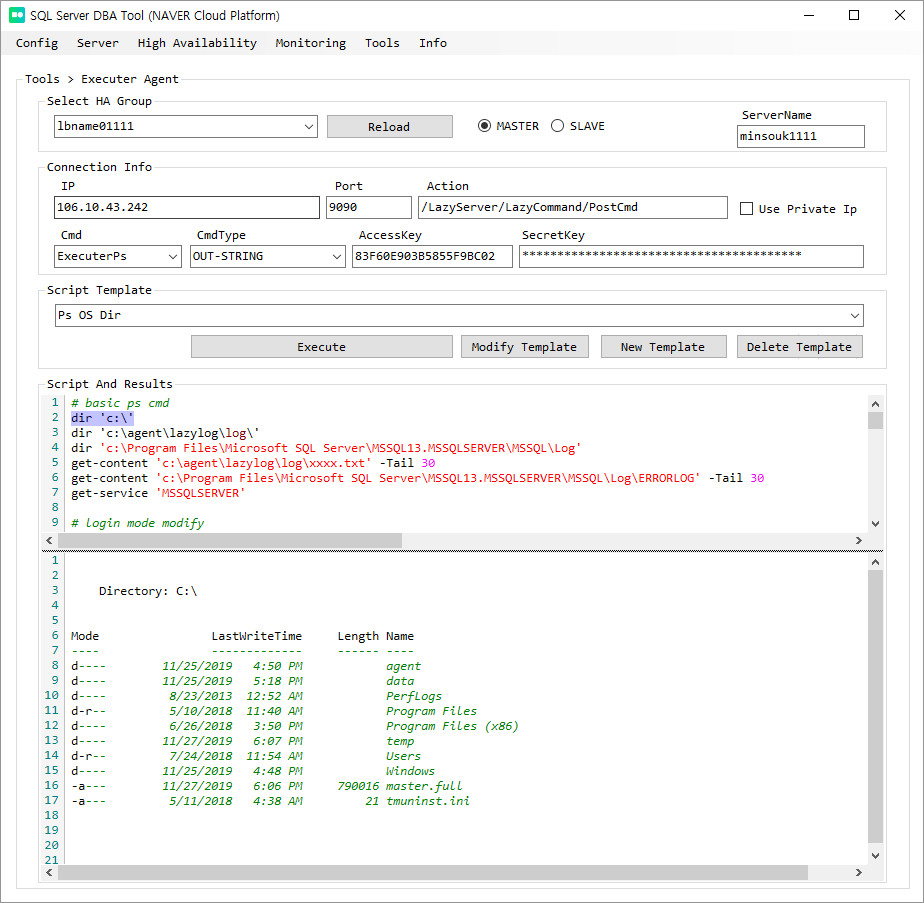

### Executer NCP API 

NCP API Gateway를 통해 서비스되는 API를 테스트해볼 수 있습니다. 아래는 NCP에서 제공하는 전체 리전을 확인하는 예시입니다. 

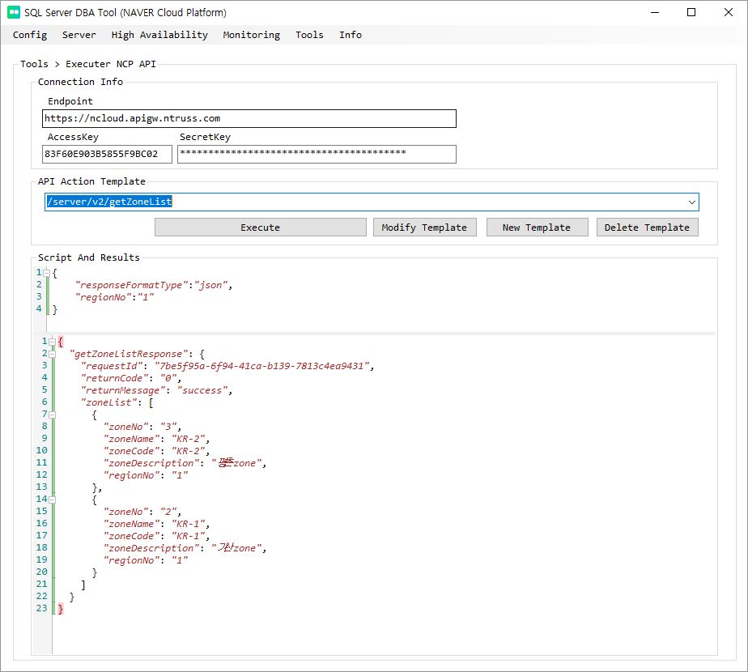


## Packages

- AWSSDK.S3
  - <https://github.com/aws/aws-sdk-net/>
  - <http://aws.amazon.com/apache2.0/>
- AWSSDK.Core
  - <https://github.com/aws/aws-sdk-net/>
  - <http://aws.amazon.com/apache2.0/>
- Newtonsoft.Json
  - <https://www.newtonsoft.com/json>
  - <https://github.com/JamesNK/Newtonsoft.Json/blob/master/LICENSE.md>
- NLog
  - <http://nlog-project.org/>
  - <https://github.com/NLog/NLog/blob/master/LICENSE.txt>
- NLog.Config
  - <http://nlog-project.org/>
  - <https://github.com/NLog/NLog/blob/master/LICENSE.txt>
- NLog.Schema
  - <http://nlog-project.org/>
  - <https://github.com/NLog/NLog/blob/master/LICENSE.txt>
- FCTB : Fast Colored TextBox for Syntax Highlighting
  - <https://www.codeproject.com/Articles/161871/Fast-Colored-TextBox-for-syntax-highlighting-2>
  - <https://github.com/PavelTorgashov/FastColoredTextBox/blob/master/license.txt>

## License

```
Copyright 2019 NAVER BUSINESS PLATFORM Corp.

This program is free software: you can redistribute it and/or modify
it under the terms of GNU LESSER GENERAL PUBLIC LICENSE as published by
the Free Software Foundation, either version 3 of the License, or
(at your option) any later version.

This program is distributed in the hope that it will be useful,
but WITHOUT ANY WARRANTY; without even the implied warranty of
MERCHANTABILITY or FITNESS FOR A PARTICULAR PURPOSE.  See the
GNU LESSER GENERAL PUBLIC LICENSE for more details.

You should have received a copy of the GNU LESSER GENERAL PUBLIC LICENSE
along with this program.  If not, see <https://www.gnu.org/licenses/>.
```


