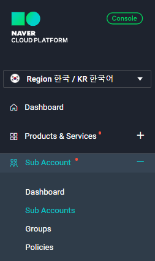
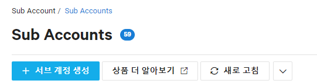
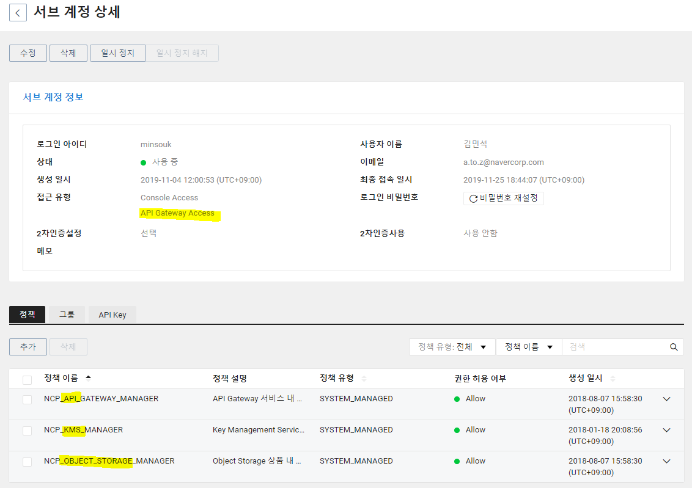
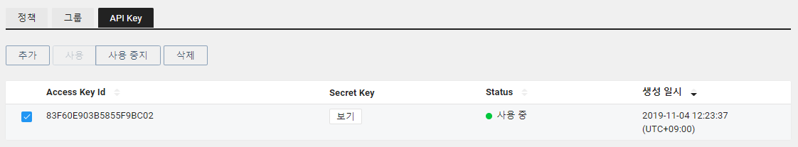
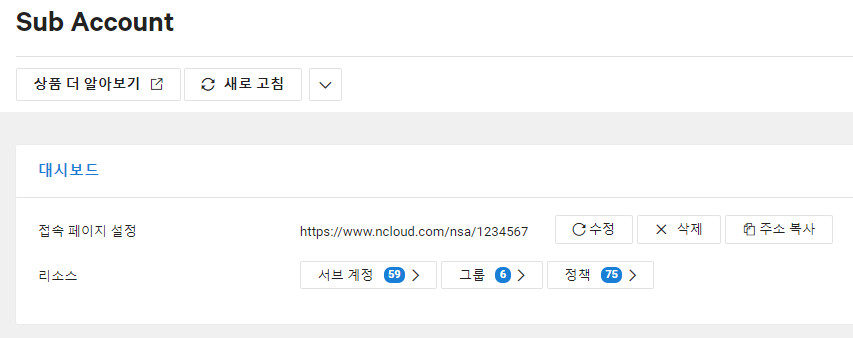
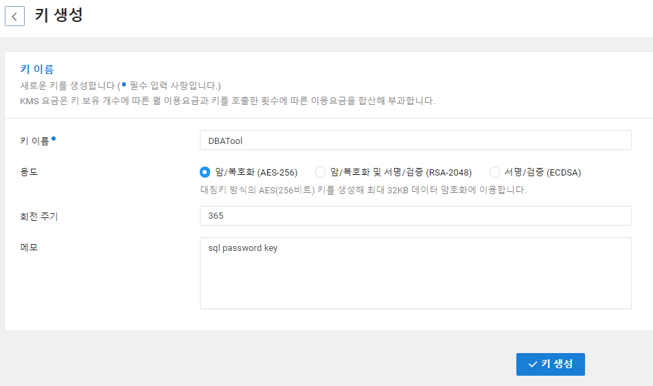
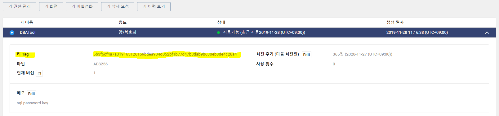
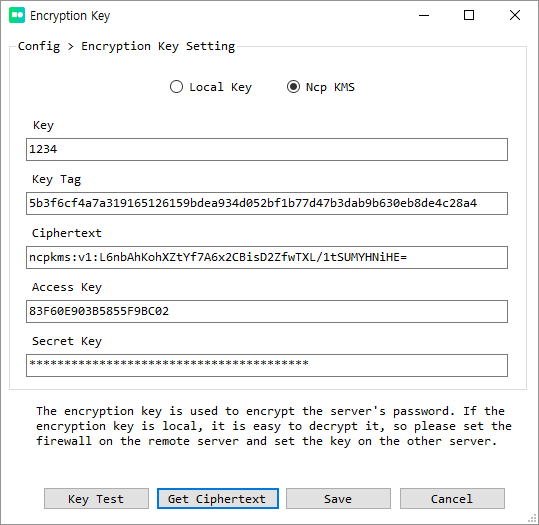
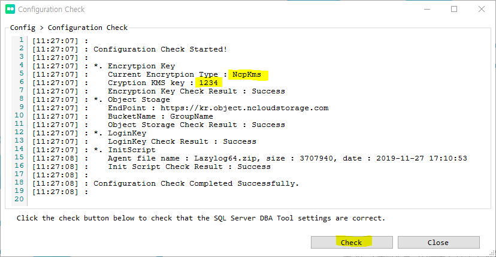

# KMS 설정

[Key Management Service](https://docs.ncloud.com/ko/kms/kms-1-1.html) 는 자동으로 설치되는 Agent 프로그램에서 SQL Server 로 접근시 암호를 보호하기 위해 사용 됩니다. Config > Encryption Key 에서 Ncp KMS 를 선택할 경우 사용됩니다. Local Key 를 선택할 경우 암호키는 각 로컬 서버 설정 파일에 암호화 되어 저장되어 있습니다. **KMS 사용을 위해서는 콘솔에서 먼저 설정 후 SQL Server DBA Tool > Config > Encryption Key 항목에서 설정 합니다.** SQL Server DBA Tool > Config 항목은 서버를 생성하기 전에 모두 완료되어 있어야 합니다. (KMS 를 SQL Server DBA Tool 에서 사용할 경우, 콘솔에서 Sub Account 설정을 완료하고 **SQL Server DBA Tool 에 Sub Account 로 로그인** 해야 합니다. 참고로 Sub Account Access Key 와 Secret Key 는 모두 대문자 입니다. )

## 콘솔설정

안전한 암호 보관을 위해 KMS 사용을 권장 하며, 해당 기능을 사용하기 위해 Sub Account 기능을 반드시 사용해야 합니다.  

1. Sub Accounts 를 생성 합니다. 

2. 생성된 Sub Accounts 에 다음과 같은 권한을 부여 합니다. 

3. 권한 설정을 완료 했으면 Sub Account 용 Access Key 와 Secret Key를 확인 합니다. 

4. Sub Account > Dashboard 에서 접속페이지를 설정 합니다. 

6. **이제 새로운 웹 브라우저를 열고 Sub Account 계정으로 접근 합니다.** 
7. Key Management Service 항목을 클릭하고 키를 생성 합니다. 

8. 키 Tag 를 확인 합니다. 

## SQL Server DBA Tool 설정

1. Config > Encryption Key 셋팅을 열고 Ncp KMS 항목을 선택
2. Key 입력 (암호를 디코드 할 때 사용할 사용자 키)
3. Key Tag 란에 위 8번 항목에서 확인한 키 Tag 를 입력 합니다. 
4. Get Ciphertext 를 클릭 합니다. 
5. Save 합니다. 

6. 설정이 올바르게 되었는지 확인 하려면, Key Test 를 눌러 확인 하거나, Config > Configuration Check 항목에서 Check 를 클릭하면 다음과 같이 항목이 잘 설정되었는지 확인 할 수 있습니다. (Key 는 이전 단계에서 **Save 후** 확인하세요.)

